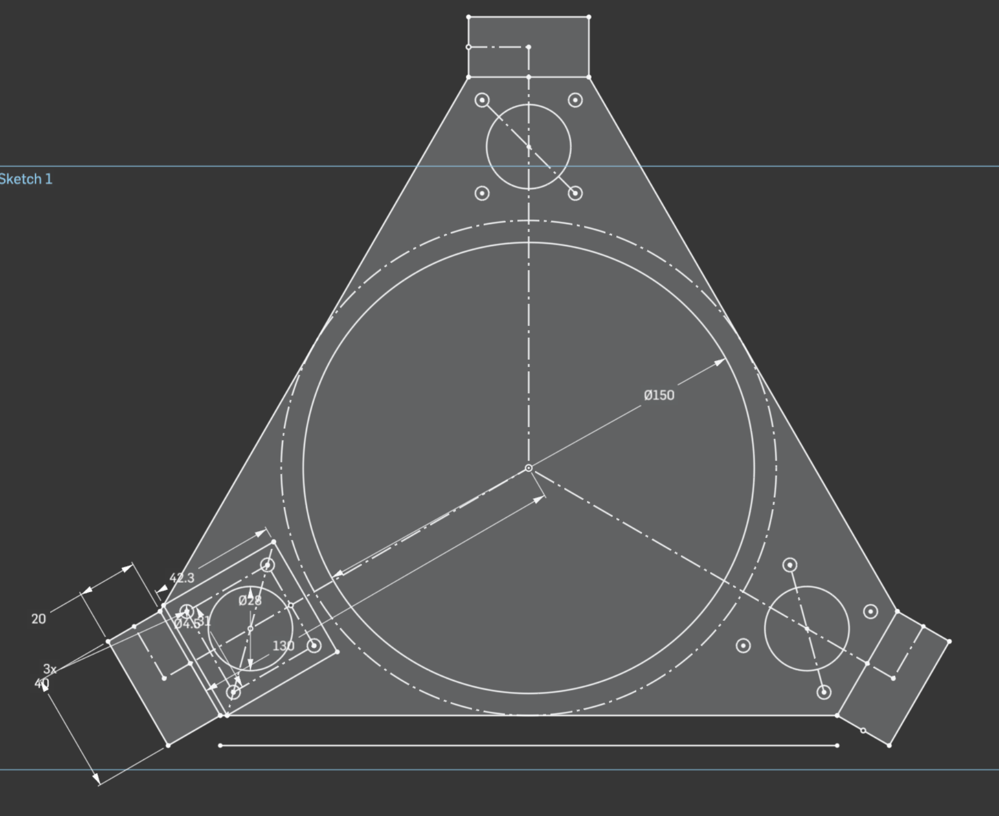
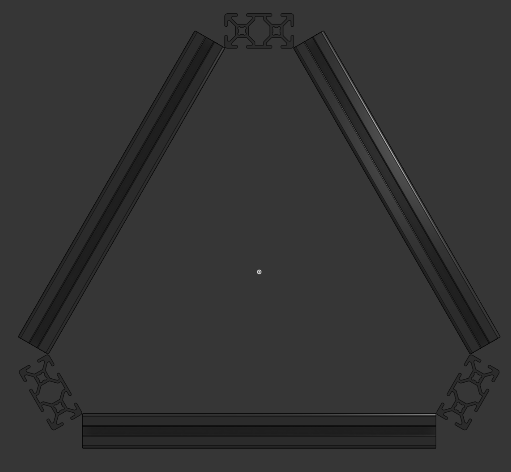
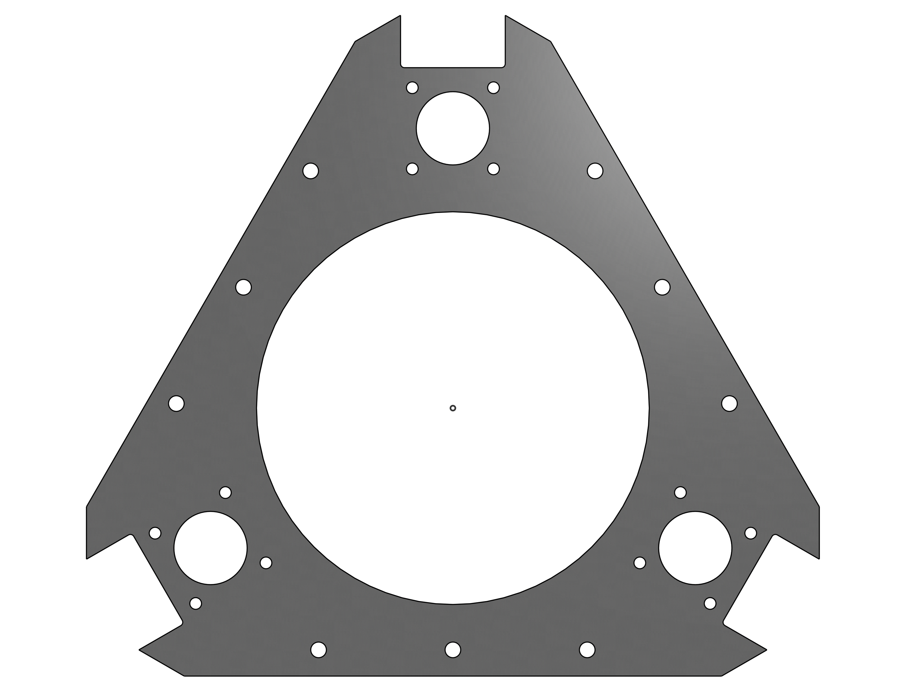
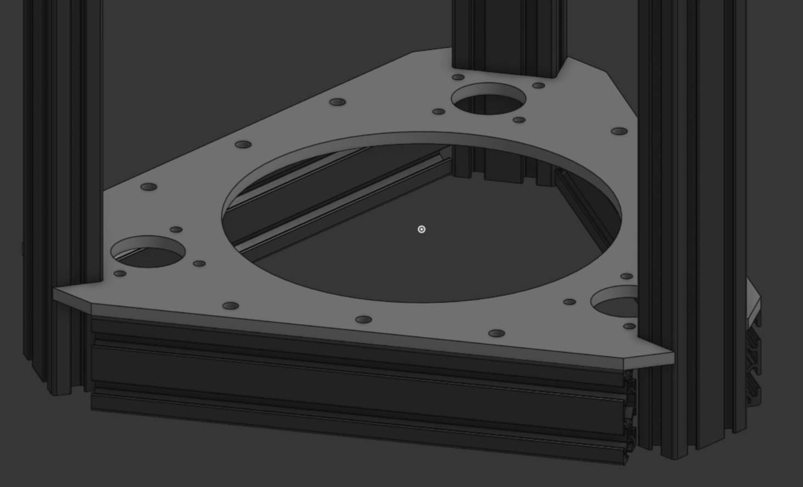
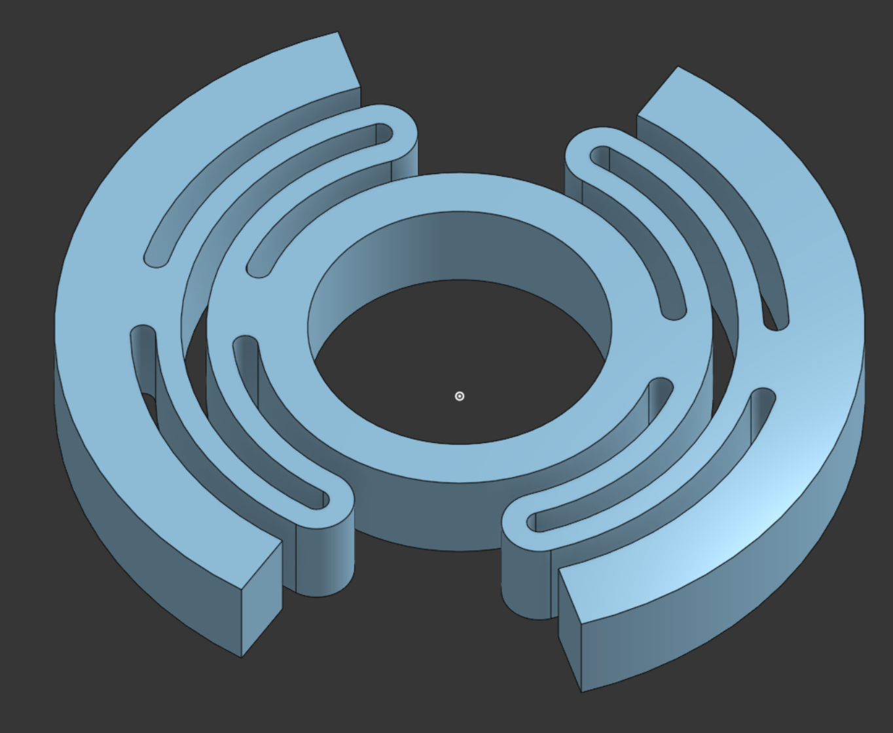
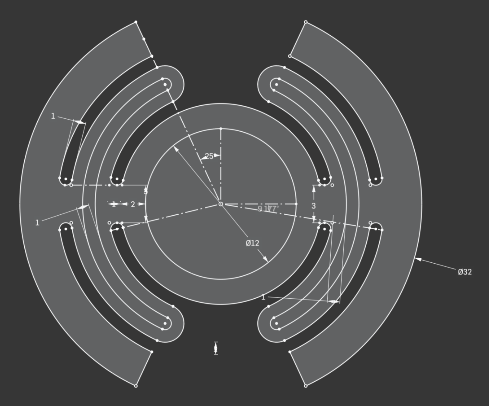

# DAVID

DAVID:
Da
Awesome
Very
Interesting
Device.

# so how did I get here? what is this thing?

It's a colinear tripteron. Or a delta tripteron. Deltaron. It's a very unique printer, to say the least.

Scrolling youtube shorts looking at parallel kinematic robots, as one does, I stumbled across [this beautiful video](https://cdn.hackclub.com/019cd205-2e08-7a96-8a9d-c828de9a12fa/tripteron_2.mp4).

No idea who created it. Just a video with no likes, 6 views, and an account with just randomly generated letters as a name.

I felt I had to create it.

# the master sketch

Master Sketching is a TDD design technique for making complicated assemblies and parts. OnShape could implement it a little bit better, but overall it's done well. I normally just let my variable studio be my master sketch, but that breaks down as you might expect it would. For this project however, I felt it fit the technique perfectly for just trying it out. I'll be honest, this journal is written 3 hours after I started designing things, so the sketch has gotten a bit..involved.

I give you: The Master Sketch.

This one sketch shows the mounting for all 3 steppers, the bed, and all 3 of the vertical things I can't remember the name of. And even includes the sketch line for the rest of the frame.

Honestly, it was pretty fast to make this thing. Took maybe half an hour in total over the last 3 hours? Overall, it's worked well and I'll be using this sorta master sketch system again. Just being able to derive this one sketch over and over has made life really easy. I've done similar things, but never really though to just genuinely put it all in one sketch. Harder to do for a CNC mill, I guess. Or modular things.

Here's the frame design I've come up with:

Nice and simple. Same as every other delta in existence.
....and then I got a little quirky with it.
and I made this thing.

I figured, since I'll need mounting holes anyway, why not just make a flat piece that mounts to the extrusions? And then I didn't want things to be cantilevered, so.....it ended up being this.
This will likely be lasercut out of acrylic since that's cheap, but it's designed for aluminum. If I have the funds & time, I'm going to try and get it made out of aluminum.

One plate isn't that expensive. It's only about $12 to machine and then another $11 for shipping. Cheap as chips. Could even buy sheet alu locally and machine it on my schools CNC if I'm really careful about it.
.....but four plates is a bit more expensive than one.

I like aluminum, ok? Don't judge me.
This behemoth is as rigid as a house. Maybe more.

There is a large hole on the top. Currently, I have no idea where the cables and such will need to go. Solution: Big hole. I would like to change it to just being 2 holes, one for a PTFE tube and one for the toolhead board cable.
God I love toolhead boards.

# the most tedious sketch of my life

This is a bearing holder. I saw the idea once a long while ago. Essentially, you can't put a bearing on the end of a leadscrew. That will cause the leadscrew to bind, as they're kinda badly made and are not straight. They have to be able to flex.

Holding the top looks nice, though. So you get this thing.

This took me an hour to make. Maybe hour and a half. I restarted 5+ times. It doesn't look complicated, but model this thing yourself and you'll see why it sucked. It's just a compliant mount for a bearing on the top of the leadscrews. That's all it is, lol.

Anyway. That's all I've done for now. Going to start working on the tripteron arms themselves. Ideally I would use carbon fiber tubes for the weight savings, but my brother has yet to finish his filament winder so I'll have to take that idea out of rotation. Perhaps I make wooden arms on the lathe though--lightweight and decently strong. Plus, it could look cool. Probably just going to end up printed though, lol.

Overall time: 3.5 hours.
